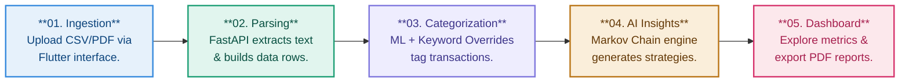

# 💰 KUBER — AI-Powered Bank Statement Analyzer

**KUBER** is an intelligent finance application designed to simplify the way people understand their bank statements.
The application uses AI to automatically read and analyze Indian bank statements, organize transactions, categorize expenses and income, and generate meaningful financial insights in a simple and user-friendly way.

---

# 📌 Overview

Managing bank statements manually can often feel confusing, stressful, and time-consuming.
KUBER solves that problem by transforming raw financial data into clear, simple, and understandable insights.

The system intelligently:

* Reads and analyzes a single Indian bank statement
* Detects and extracts transaction details automatically
* Categorizes expenses and income into meaningful groups
* Organizes statements for easier financial tracking
* Generates smart financial summaries and insights
* Helps users understand spending habits and financial patterns

By simplifying complex banking data, KUBER empowers users to manage money more confidently and make smarter financial decisions in everyday life.

---

# ✨ Features

* 📄 Automatic Bank Statement Analysis
* 🤖 AI-Powered Transaction Understanding
* 💸 Expense & Income Categorization
* 📊 Financial Insights & Spending Patterns
* 🧾 Organized Transaction Management
* 🔍 Smart Financial Summaries
* ⚡ Simple and User-Friendly Experience

---
# 🎡 FROM PDF & CSV FILE TO INSIGHTS IN FIVE STEPS

# 🛠️ Technologies Used

* **Frontend:** HTML, CSS, JavaScript
* **Backend:** Node.js / Python *(customize as needed)*
* **AI/ML:** OpenAI API / NLP Models *(customize as needed)*
* **Database:** Firestore[ / MySQL *(optional)*]

---

# 🚀 How It Works

1. Upload a bank statement
2. The AI processes and extracts transaction details
3. Transactions are categorized automatically
4. Financial patterns and summaries are generated
5. Users receive simple, easy-to-understand insights

---

# 🎯 Project Goal

KUBER aims to make financial understanding accessible and stress-free by converting complicated bank statements into meaningful and actionable insights that help users make better financial decisions.

---

# 📷 Future Enhancements

* Multi-bank statement support
* Monthly financial reports
* Budget tracking system
* Fraud or unusual transaction detection
* Interactive data visualization dashboards
* Voice-based financial assistant

---

# 🤝 Contribution

Contributions, suggestions, and improvements are always welcome.

1. Fork the repository
2. Create a new branch
3. Commit your changes
4. Submit a Pull Request

---

# 📄 License

This project is still under license process.

---

# 👨‍💻 Developed By

--> **Rani Bhattarcharjee**(Leader & Software Design)

--> **Ritankar Bose**(Full Stack Development)

--> **Abhirup Ghosh**(Web development & Software Architect)

B.Tech CSE Students | 2nd YEAR 
